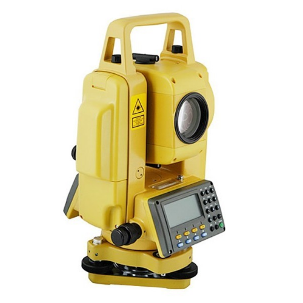

# South Total Station NTS-350/350R Series data converter

## Description
This solution converts data files created by the South Total Station NTS-350/350R Series into regular csv files. The user interface is minimal targeting in the easiest User eXperience. I have written this on python 2 on 2014 to help a friend who is topographer.

## Features
- The conversion is done by a python 3 script that takes no arguments
- Multiple .dat files can be converted at once, simply by putting them in the input directory

## Installation
- Clone the repository using `git clone https://github.com/tanastasiadis/south-total-station-data-converter.git` 
- Install Python 3.X

## Usage
1. Place the dat files in the input directory
2. Execute the application (check below)
3. Receive the conveted files from the output directory

### Execution under Linux
- If python is in $PATH variable, execute:
`run.sh`
- If python is not in $PATH variable, execute:
`/path/to/python src/python3/data_converter.py`

### Execution under Windows
- Execute:
`run.bat`
- If python.exe is not in %PATH% variable, execute:
`/path/to/python.exe src/python3/data_converter.py`

## Contribute
Pull requests, bug reports, and feature requests are welcome.

## License
This software is under MIT licence.

